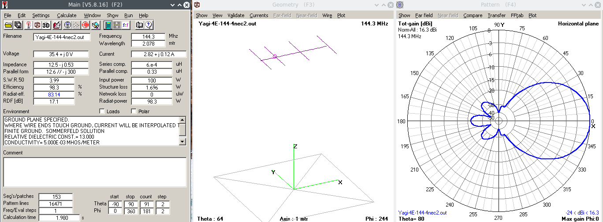
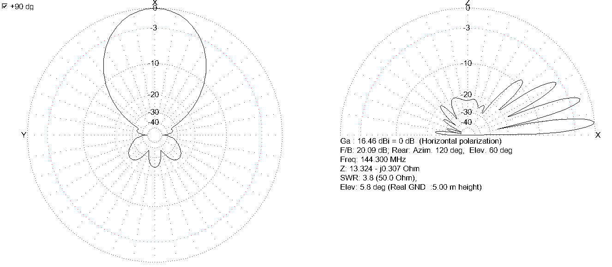
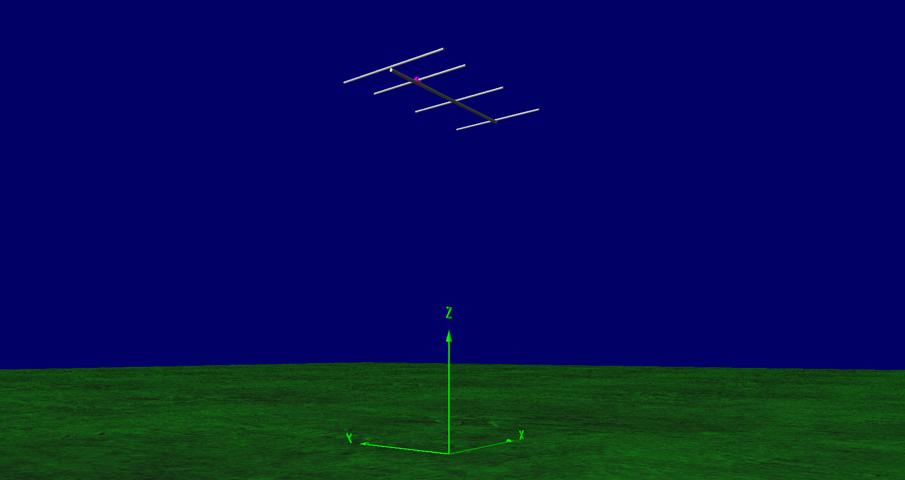
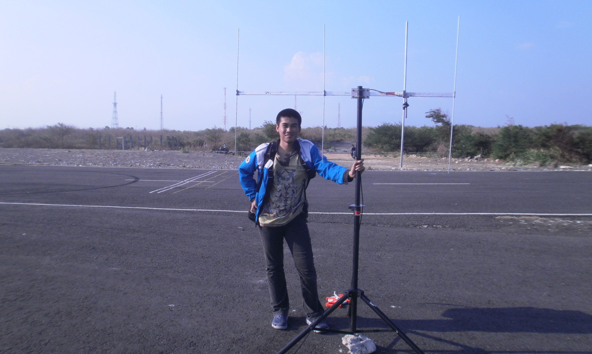
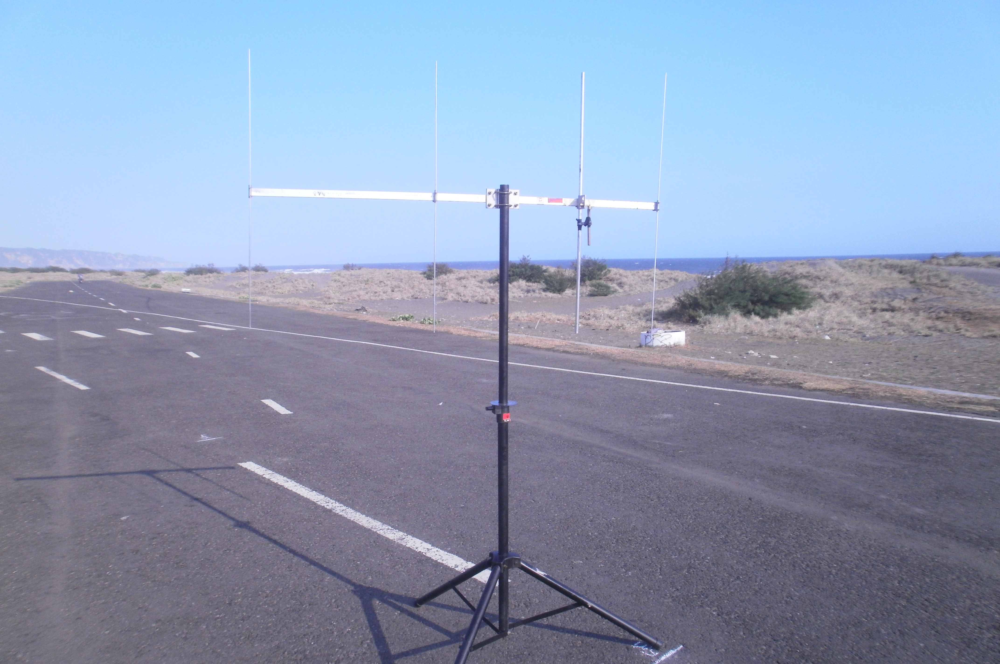

# 4 Elements Yagi Antenna for 144.3 MHz
4-elements Yagi Antenna for 144.3 MHz - 12.5 Ohm design. Meant to be fed using a gamma match.
This antenna won the Techno Antenna Fair 2014 - 2015 for Directional Antenna Category.

## Properties
* Elements : 1 reflector + 1 driven element + 2 directors
* Boomlength : 1.5 m
* Material : Aluminium alloy tubes / rods
* Input impedance : 12.5 Ohm resistive nominal (use a gamma match to bring it to 50 Ohm)
* Gain dBd : better than 16 dBi (simulation, atleast 3 meters above average ground, horizontal polarization)

## Geometries

|Element        |Length,mm (full span)|diameter,mm|Position,mm|
|:-------------:|:-------------------:|:---------:|:---------:|
|Reflector      |1020                 |4          |0          |
|Drivent element|949                  |10         |320        |
|Director 1     |942                  |4          |860        |
|Director 2     |922                  |4          |1480       |

## Simulations
The simulation files are included in **Yagi-4E-144/models/**. The .nec file is created using [4NEC-2](https://www.qsl.net/4nec2/) and .maa file is created using [MMANA-GAL](https://hamsoft.ca/pages/mmana-gal.php)

## During Testing

## Contributing
1. Fork it [https://github.com/handiko/Yagi-4E-144/fork](https://github.com/handiko/Yagi-4E-144/fork)
2. Create new branch (`git checkout -b add-blah-blah`)
3. Do some editing / create new feature
4. Commit your works (`git commit -m "Adding some blah blah blah.."`)
5. Push to the branch (`git push -u origin add-blah-blah`)
6. Create a new Pull Request
